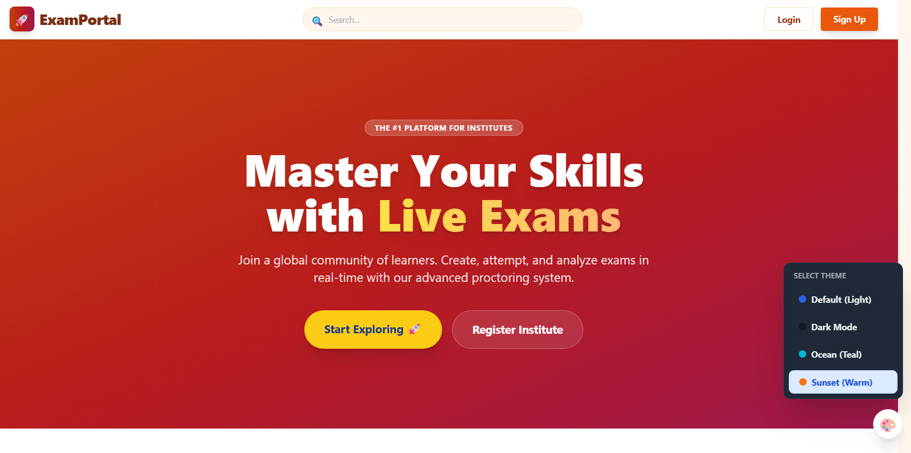
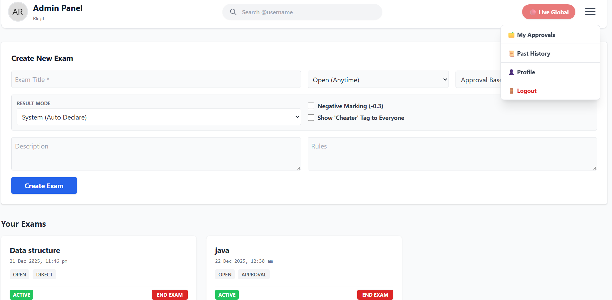
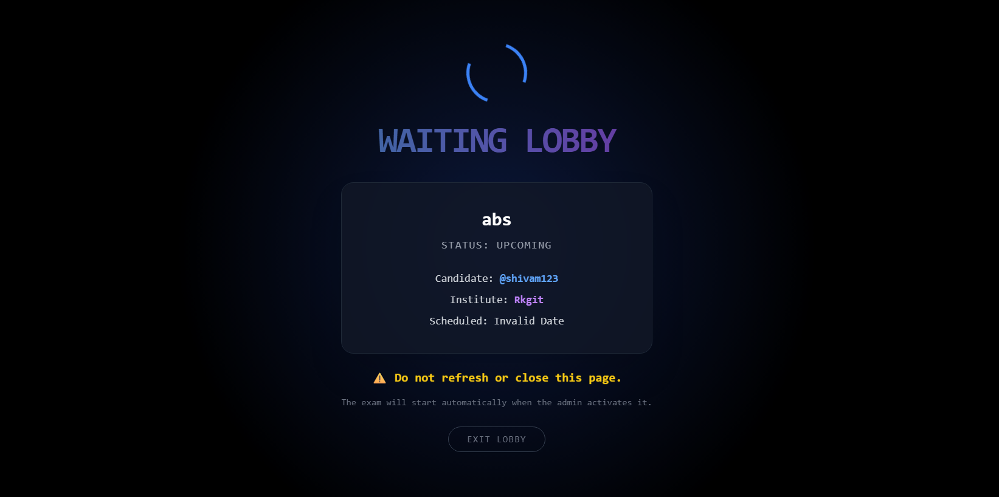
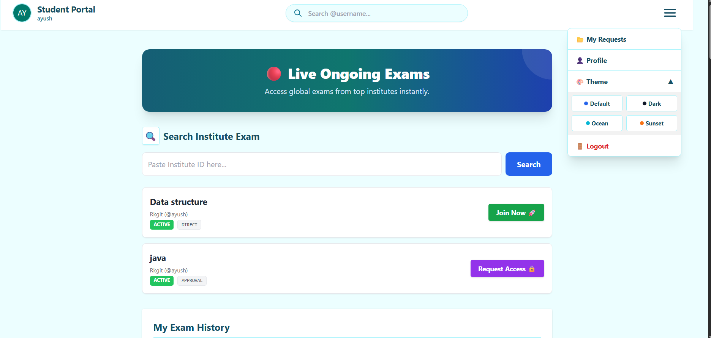

# 🚀 ExamPorta - Secure Online Examination System

**ExamPorta** is a robust, full-stack web application designed to bridge the gap between Institutes (Admins) and Students. It allows institutes to conduct secure, live, and open exams while providing students with a seamless testing interface, real-time results, and performance analytics.

Built with **React.js** and powered by **Firebase**.

---

## ✨ Key Features

### 🎓 For Institutes (Admins)
- **Create Exams:** Schedule **Live Exams** (specific date/time) or **Open Exams** (available anytime).
- **Access Control:** Choose between **Direct Entry** or **Approval-Based** joining.
- **Question Manager:** Add, edit, or delete multiple-choice questions easily.
- **Candidate Management:** View enrolled students and approve/reject join requests.
- **Result Management:** Auto-declare results or keep them hidden for manual release.
- **Cheater Identification:** "Cheater" tags for students who switch tabs or violate rules.
- **Global Visibility:** Option to make exams public on the Global Dashboard.

### 🧑‍🎓 For Students
- **Exam Lobby:** Seamless interface to join exams via Institute ID or Global Search.
- **Request System:** Send access requests for private/approval-based exams.
- **Live Exam Interface:** Full-screen exam mode with timer and auto-submission.
- **Instant Results:** View detailed scorecards and correct answers (if allowed).
- **Leaderboards:** Compare performance with other candidates globally or institute-wise.
- **Profile:** Manage bio, social links, and view exam history.

### 🌟 Common Features
- **Role-Based Auth:** Secure Login/Signup for Students and Admins via Firebase.
- **Theme System:** Built-in support for **Light, Dark, Ocean, and Orange** themes.
- **Mobile Responsive:** Fully optimized UI for Desktops, Tablets, and Mobile devices.
- **User Search:** Search for other users or institutes using their unique usernames.
- **Security:** Logic to hide Institute IDs from other admins to prevent spam.

---

## 📂 Project Structure

```bash
src/
├── config/
│   └── firebase.js          # Firebase initialization & configuration
│
├── context/
│   ├── AuthContext.js       # Manages User Authentication State
│   └── ThemeContext.js      # Manages Global Theme
│
├── modules/
│   ├── Auth/                # 🔐 Authentication
│   │   ├── Login.jsx        # User Login
│   │   └── Signup.jsx       # User Registration
│   │
│   ├── Public/              # 🌍 Public Pages
│   │   └── LandingPage.jsx  # Home Page (Hero, Features)
│   │
│   ├── Admin/               # 🎓 Institute/Admin Modules
│   │   ├── AdminDashboard.jsx    # Main Dashboard Panel
│   │   ├── AdminGlobalExams.jsx  # Global Exam View for Admins
│   │   ├── AdminApprovals.jsx    # Accept/Reject Student Requests
│   │   ├── QuestionManager.jsx   # Add/Delete Questions
│   │   ├── ManageCandidates.jsx  # View Student Lists
│   │   ├── ExamResults.jsx       # Declare Results & View Scores
│   │   └── AdminHistory.jsx      # Past/Deleted Exams Log
│   │
│   ├── Student/             # 🧑‍🎓 Student Modules
│   │   ├── StudentDashboard.jsx  # Main Student Dashboard
│   │   ├── GlobalLiveExams.jsx   # Public Open Exams
│   │   ├── ExamLobby.jsx         # Waiting Area before Exam
│   │   ├── ExamPaper.jsx         # Main Exam Interface (Timer, Anti-Cheat)
│   │   ├── MyResults.jsx         # History & Leaderboards
│   │   └── MyRequests.jsx        # Track Sent Requests
│   │
│   └── Common/              # 🌟 Shared Components
│       ├── UserProfile.jsx       # Full Profile Page
│       ├── UserProfileModal.jsx  # Profile Popup
│       ├── UserSearch.jsx        # Search Component
│       └── ThemeSwitcher.jsx     # Floating Theme Toggle
│
├── App.js                   # Main Router Configuration
├── index.js                 # Entry Point
└── index.css                # Tailwind Imports & Global Mobile Fixes

## 🛠️ Tech Stack

* **Frontend:** React.js (Hooks, Context API, React Router)
* **Styling:** Tailwind CSS (Custom Theme Configuration)
* **Backend/Database:** Firebase Firestore (NoSQL)
* **Authentication:** Firebase Auth
* **Hosting:** GitHub Pages / vercel

---

## 🚀 Getting Started

Follow these instructions to run the project locally.

### Installation

1. **Clone the repository**
```bash
git clone [https://github.com/ayushraistudio/exam-porta.git](https://github.com/ayushraistudio/exam-portal.git)
cd exam-portal

```


2. **Install Dependencies**
```bash
npm install

```


3. **Run the Application**
```bash
npm start

```


The app will open at https://exam-porta.vercel.app
## 📸 Screenshots

| Landing Page | Admin Dashboard |
|:---:|:---:|
|  |  |

| Exam Interface | Mobile View |
|:---:|:---:|
|  |  |
---

## 🤝 Contributing

Contributions are welcome! Please fork the repository and create a pull request.

1. Fork the Project
2. Create your Feature Branch (`git checkout -b feature/AmazingFeature`)
3. Commit your Changes (`git commit -m 'Add some AmazingFeature'`)
4. Push to the Branch (`git push origin feature/AmazingFeature`)
5. Open a Pull Request

---

## 📜 License

Distributed under the MIT License. See `LICENSE` for more information.

---

### Developed with ❤️ by **Ayush Rai**

